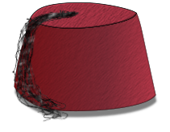

# FEZ - Custom DOM Elements

FEZ is a small library (17kb unziped) that allows writing of [Custom DOM elements](https://developer.mozilla.org/en-US/docs/Web/API/Web_Components/Using_custom_elements) in a clean and easy-to-understand way.

It uses

* [Goober](https://goober.js.org/) to enable runtime SCSS (similar to styled components)
* [Stache](https://github.com/ryanmorr/stache) to render templates (similar/same to Svelte templates)
* [Idiomorph](https://github.com/bigskysoftware/idiomorph) to morph DOM from one state to another (as React or Stimulus/Turbo does it)

Latest version of libs are baked in Fez distro.

It uses minimal abstraction. You will learn to use it in 3 minutes, just look at example, it includes all you need to know.

## How to install?

Add `<script src="https://cdn.jsdelivr.net/gh/dux/fez-custom-dom-elements@latest/dist/fez.js"></script>`

To start

* define [Fez tag](https://dux.github.io/fez/)
* add HTML. YOu can copy&paste from examples, must work.

## Little more details

Basically, it is logical variant of [lit.js](https://lit.dev/) or [Rails Stimulus](https://stimulus.hotwired.dev/). FEZ uses native DOM instead of shadow DOM, has an easy-to-debug and "hack" interface. It also tries to be as close to vanilla JS as possible. If you need TypeScript support, Shadow DOM, or a stronger community, use Lit.

It replaces modern JS frameworks by using native Autonomous Custom Elements to create new HTML tags. This has been supported for years in [all major browsers](https://caniuse.com/custom-elementsv1).

This article, [Web Components Will Replace Your Frontend Framework](https://www.dannymoerkerke.com/blog/web-components-will-replace-your-frontend-framework/), is from 2019. Join the future, ditch React, Angular and other never defined, always "evolving" monstrosities. Vanilla is the way :)

## How it works

* define your custom component - `Fez('ui-foo', class UiFoo extends FezBase)`
* add HTML - `<ui-foo bar="baz" id="node1"></ui-foo>`
  * lib will call `node1.fez.connect()` when node is added to DOM and connect your component to dom.

That is all.

## What can it do?

* It can create and define Custom HTML tags, libs main feature
* it can style components using SCSS, using [goober](https://goober.js.org/).
* it has fuw useful built in helper methods as formData(), setInterval() that triggers only while node is connected, etc
* it has <slot /> support
* It has garbage collector, just add tags to HTML and destroy as you which.
* It will close "HTML invalid" inline items before rendering `<fez-icon name="gear" />` -> `<fez-icon name="gear"></fez-icon>`
* it has built in pub-sub, where only connected nodes will be able to publish and receive subs.
* It morphs DOM on `this.html(...)`, same as `React`.
* upon `connect()`, it will convert custom DOM nodes to plain HTML tags, for easy and accurate styling. Example: `<fez-btn href="/foo" title="Bar" />` -> `<a class="btn btn-empty" href="/foo">Bar</a>`

## What it does not do?

* It has no build in routing. This is lib for building DOM components. Works great with any server side rendering or libs like [HTMLX](https://htmx.org/) or even React or Angular. Fez is great way to continue working on legacy JS apps that are too complicated to migrate. Just write new components in Fez.

## Why?

Because it is plain DOM + HTML. There is no framework, as React, Svelte, Vue, Angualr etc.
There is nothing to learn or "fight", or overload or "monkey patch" or anything. It just works.

There is on drawback too. If it works in Vannila JS, it will work here to.

It great in combination with another wide ude JS libs, as jQuery, Zepto, underscore of loDash.

## Full available interface

```js
// add global css
Fez.globalCss(`
  .some-class {
    color: red;
    &.foo { ... }
    .foo { ... }
  }
  ...
`)

Fez('foo-bar', class extends FezBase {
  // set element style, set as property or method
  static css() { .. }
  static css = ` scss string... `

  // set element node name, set as property or method, defaults to DIV
  // why? because Fez converts fez components to plain HTML
  static nodeName = 'span'
  static nodeName(node) { ... }

  // unless node has no innerHTML on initialization, bind will be set to slow (fastBind = false)
  // if you are using components that to not use innerHTML and slots, enable fast bind (fastBind = true)
  // <fez-icon name="gear" />
  static fastBind = true
  static fastBind(node) { ... }

  connect(props) {
    // internal, get unique ID for a string, poor mans MD5
    const uid = this.klass.fnv1('some string')

    // copy attributes from attr hash to root node
    this.copy('href', 'onclick', 'style')

    // internal, check if node is attached
    this.isAttached()

    // copy all child nodes from source to target, without target returns tm node
    this.slot(someNode, tmpRoot)
    const tmpRoot = this.slot(self.root)

    // clasic interval, that rune only while node is attached
    this.setInterval(func, tick) { ... }

    // get closest form data, as object
    this.formData()

    // get generated css class (uses gobber.js)
    const localCssClass = this.css(text)

    // mounted DOM node root
    this.root

    // mounted DOM node root wrapped in $, only if jQuery is available
    this.$root

    // node properties as Object
    this.props

    // gets single attribute or property
    this.prop('onclick')

    // shortcut for this.root.querySelector(selector)
    this.find(selector)

    // gets value for FORM fields or node innerHTML
    this.val(selector)

    // gets root childNodes. pass function to loop forEach on selection
    this.childNodes(func)

    // render template and attach result dom to root. uses Idiomorph for DOM morph
    this.html(`
      {{if @list}}
        <ul>
          {{#each this.list as name, index}} // runs in node scope
          {{#each @list as name, index}}
          {{#for name, i in @list} // you can use for loop
            <li>
              <input onkeyup="$$.list[{{ index }}].name = this.value" value="{{ name }}" /> // $$ will point to fez instance
            </li>
          {{/list}}
        </ul>
      {{/if}}
      <span class="btn" onclick="$$.getData()">read</span>

      <h3>Svelte inspired</h3>
      <span fez-this="data.foo">bind this node to this.data.foo</span>
      <span fez-use="colorize">pass this node to this.colorize</span>
    `)
  }

  // if you want to monitor new or changed node attributes
  this.onPropsChange(name, value) { ... }
})
```

## Examples

All examples are avaliable on [jsitor](https://jsitor.com/QoResUvMc).

### Show time ticker and change border color on refresh

This component explains all basic concepts.

If you understand how this works, you know FEZ. I am sorry it is this simple.

* you add custom dom nodes as simple HTML tags. You can pass args too.
* you can set your desired node name via `nodeName` static method, defaults to `div`.
* you can define custom style with modern features.
* when tag (node) is added to HTML DOM
  * `Fez` component is created and `connect()` is called
  * `this.setInterval(...)` loops only if node is attached to doom.
    Clears itself once node is detached from DOM.
  * this is all, now you are free to do whatever you want.

###### HTML
```html
<ui-time city="Zagreb"></ui-time>
```

###### JS
```js
Fez('ui-time', class extends window.FezBase {
  // default node name is DIV, fell free to change.
  // Why native node name, in this case "<ui-time" is not used is explained in FAQ.
  static nodeName = 'div'

  // when element is used for the first, global element style will be injected in document head
  // style will nave id="fez-style-ui-time"
  static css(`
    border: 5px solid green;
    border-radius: 10px;
    padding: 10px;
    font-family: var(--font-family);

    button {
      font-size: 16px;
    }
  `)

  // plain JS function to get random color
  getRandomColor() {
    const colors = ['red', 'blue', 'green', 'teal', 'black', 'magenta']
    return colors[Math.floor(Math.random() * colors.length)]
  }

  updateTime() {
    // this.$root will return jQuery root. shortcut for $(this.root)
    // without jQuery: this.root.querySelector('.time').innerHTML = new Date()
    this.$root.find('.time').html(new Date())
  }

  // update border color, with random color
  refresh() {
    $(this.root).css('border-color', this.getRandomColor())
  }

  connect() {
    // Fez(this) will return pointer to first root FEZ component.
    // If you want to target specific one by name, add it as second argument -> Fez(this, 'ui-time2')
    this.html(`
      {{ @props.city }}:
      <span class="time">{{ new Date() }}</span>
      &mdash;
      <button onclick="$$.refresh()">refresh</button>
    `)

    // use FEZ internal setInterval, It is auto cleared when node is removed from DOM.
    this.setInterval(this.updateTime, 1000)
  }
})
```

## More in detail

### when fez init runs

* attaches HTML DOM  to`this.root`
* renames root node from original name to `static nodeName() // default DIV`
* classes `fez` and `fez-ui-foo` will be aded to root.
* adds pointer to instance object to `fez` property (`<div class="fez fez-ui-foo" onclick="console.log(this.fez)"`)
  * in parent nodes access it via `Fez(this)` with optional tag name `Fez(this, 'ui-foo')`. It will look for closest FEZ node.
* creates object for node attributes, accessible via `this.props`. `<ui-foo name="Split">` -> `this.props.name == 'Split'`

### style()

* You can define it as string or a method.
* If you omit style tag, css will be wrapped in component.
* if you define style tag, only ID will be added and content will be copied "as it is"

Do not forget nesting is supported in CSS now, you do not need scss and similar pre-processors.

#### Examples

```js
// adds global css
Fez.globalCss(`...`)

Fez('ui-foo', class extends window.FezBase {
  // local css
  static css = `color: blue;`
}
```

###### produces
```html
<html>
  <head>
    <style id="fez-style-ui-foo">
    .fez-ui-foo {
      color: blue;
    }
    </style>
    ...
  <head>
  ...
```

### forms

There is FEZ instance helper method `this.formData()`, that will get form data for a current or closest form.

You can pass node DOM refrence, for a form you want to capture data from.

### how to call custom FEZ node from the outside, anywhere in HTML

Inside `connect()`, you have pointer to `this`. Pass it anywhere you need, even store in window.

Example: Dialog controller

```html
<ui-dialog id="main-dialog"></ui-dialog>
```

```js
Fez('ui-dialog', class extends FezBase {
  close() {
    ...
  }

  connect() {
    // makes dialog globally available
    window.Dialog = this
  }
})


// close dialog window, from anywhere
Dialog.close()

// you can load via Fez + node selector
Fez('#main-dialog').close()
```

## static helper functions

* ### Fez.find(selectorOrNode, 'optional-tag-name')

Finds first closest Fez node.

* ### this.class.css(text)

  Static `css()` method adds css globaly, to `document.body`.

## instance attributes

* ### this.props

  List of given node attributes is converted to props object

* ### this.root

  Pointer to Fez root node.

* ### this.$root

  jQuery wrapped root, if jQuery is present.

## instance functions

* ### this.connect(root, props)

  Called after DOM node is connected to Fez instance.

* ### this.copy(attr1, artr2, ...)

  Copies atrributes from attribute object to root as node attributes. If attribute is false, it is skipped.

  ```js
    connect() => {
      this.copy('href', 'onclick', 'style', 'target')
    }
  ```

* ### this.slot(source, target = null)

  Moves all child nodes from one node to another node.

  ```js
    connect() => {
      // move all current child nodes to tmpNode
      const tmpNode = this.slot(this)

      // move all child nodes from node1 to node2
      const tmpNode = this.slot(node1, node2)
    }
  ```

* ### this.html(htmlString)

  Inject htmlString as root node innerHTML

  * replace `$$.` with local pointer.
  * replaces `<slot />` with given root

  ```js
    getData() => {
      alert('data!')
    }

    connect() => {
      this.html`
        <ul>
          {{#list}}
            <li>
              <input type="text" onkeyup="$$.list[{{num}}].name = this.value" value="{{ name }}" class="i1" />
            </li>
          {{/list}}
        </ul>
        <span class="btn" onclick="$$.getData()">read</span>
      `
    }
  ```

* ### this.parse(text, context or this)

  Same as `this.html()` but

  * it does not render slot
  * returns string instead attaching to `this.root`.


* ### this.css(text, optionalAddToRoot)

  Uses [goober](https://goober.js.org/) to render inline css.
  Same as React styled-components, it returns class that encapsulates given style.

  Pass second argument as true, to attach class to root node.

  ```js
  const className = this.css(`
    color: red;
      &.blue {
        color: blue;
      }
    }`
  )
  ```

* ### this.prop(name)

  Get single property. It will first look on original root node, if not found it will look for attribute.

  ```js
  const onClickFunction = this.prop('onclick')
  const idString = this.prop('id')
  ```

* ### this.onPropsChange(name, value)

  If you want to monitor new or changed node attributes.

  ```html
    <fez-icon id="icon-1" name="gear" color="red" />
  ```

  ```js
    Fez('fez-icon', class extends FezBase {
      // ...

      this.onPropsChange(name, value) {
        if (name == 'color') {
          this.setColor(value)
        }
      }
    })

    // same thing
    document.getElementById('icon-1').setAttribute('color', 'red')
    $('#icon-1').attr('color', 'red')
    Fez('#icon-1').setColor('red')
  ```


